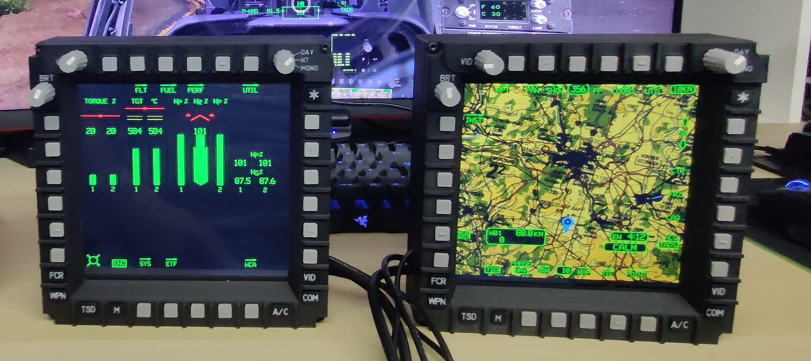

# AH-64D-Apache-MPD-Multi-Purpose-Display
Adruino based  MPD (Multi-Purpose-Display) for the DCS AH-64D Apache

Demo: [https://youtube.com/shorts/2huMgZh5P64](https://youtu.be/b7H5Edohsew)

Complete CP/G Frontpanel: https://www.youtube.com/shorts/GwC2EZVeXsk

This is my MPD for the DCS AH-64D Apache. The project includes 3D-printable files, full build guide, optional parts with raised labels or laser engraving support, and of course my code for the Arduino. The total cost to build one MPD is approximately €70 or about $80. If Arduino feels like a complete mystery to you, I also describe an alternative build using a Leobodnar BBI-64 USB game controller board. This option is basically plug & play, but it does increase the cost.

**RTFM** -- read the **Build-Guide.pdf** !!

**LICENSE:**
Creative Commons Attribution-NonCommercial 4.0 International Public License

# My projects have been downloaded thousands of times in the past. Providing the files and creating a guide is very time-consuming. Since no one is willing to make even a small donation, I have decided to offer the 3D files only for a small fee from now on. https://cults3d.com/de/modell-3d/gadget/ah-64d-mpd-multi-purpose-display

# 🛠 Experiencing this issue? DCS-BIOS loses connection to Arduino Mega on mission restart
Check out this workaround/fix: https://github.com/MilKris666/DCS-BIOS-socat-reset
